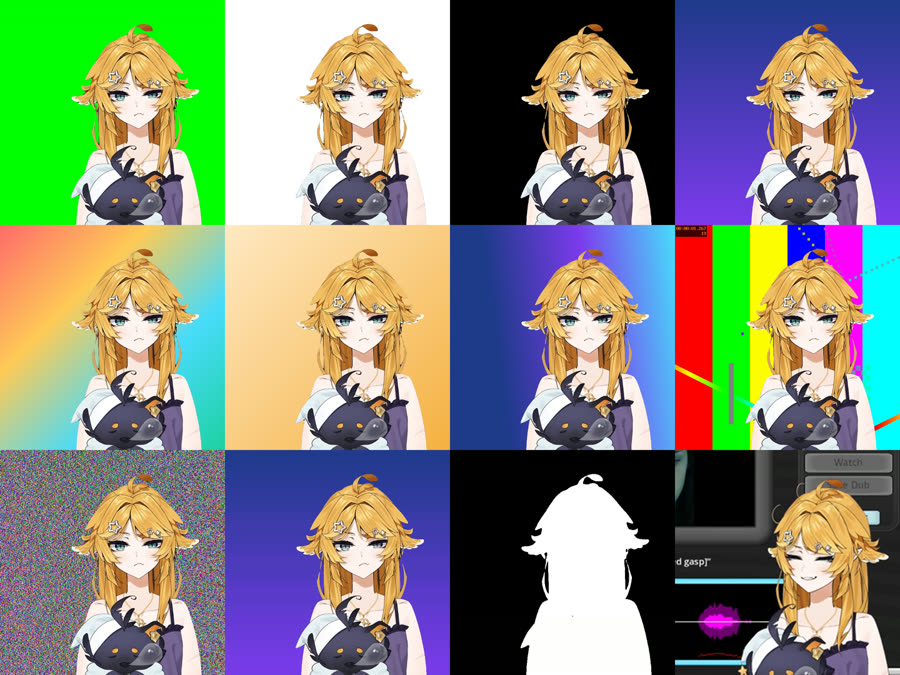
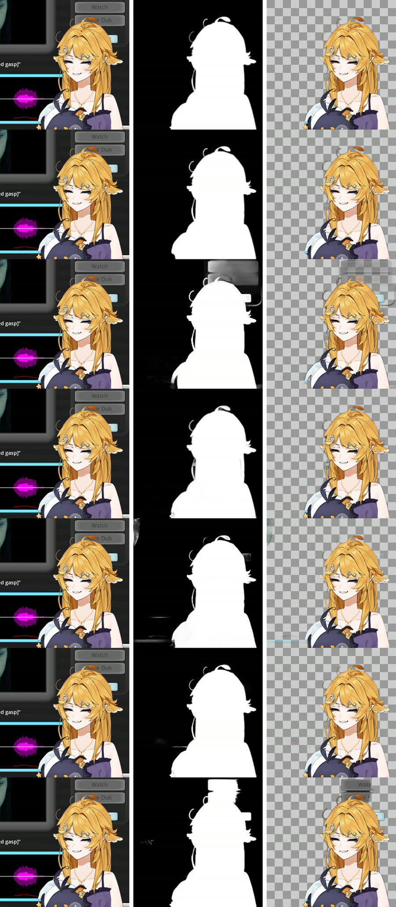
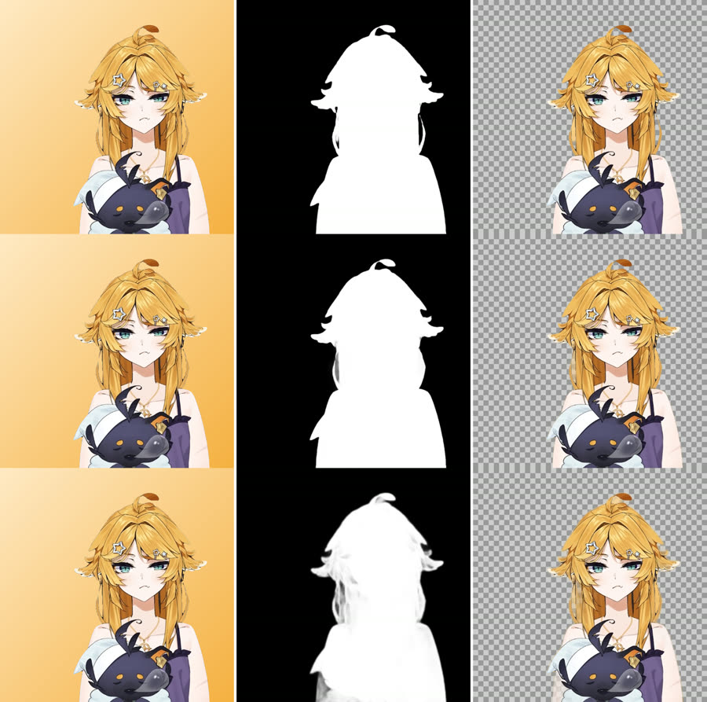
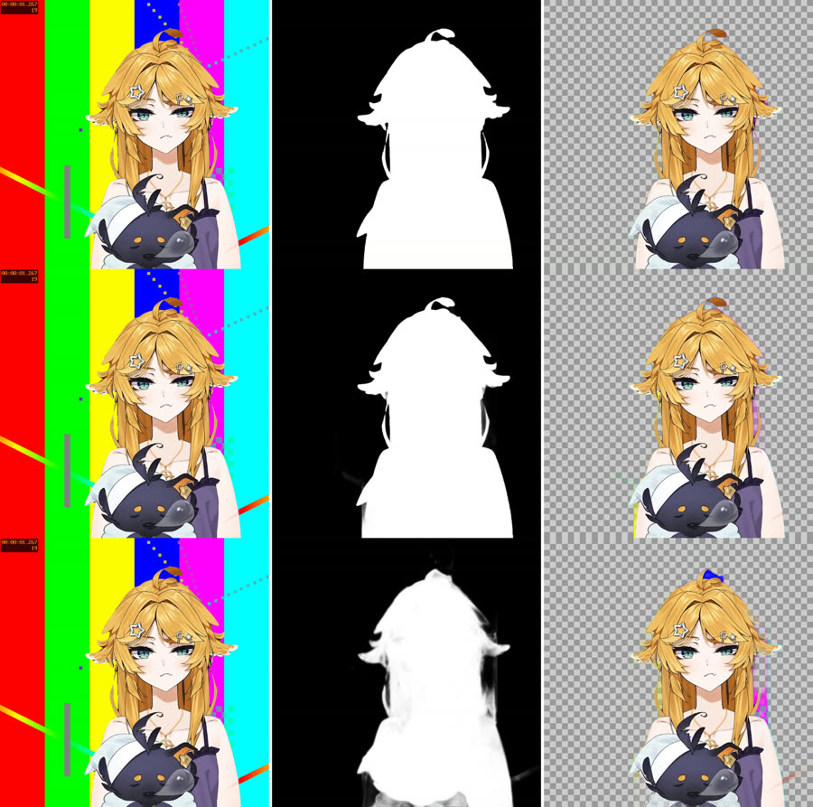
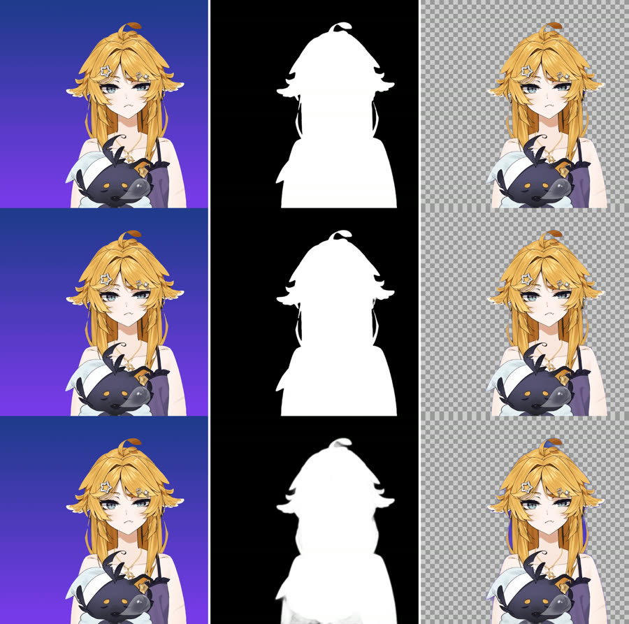

# Background removal research — 2026-10-08

The notes behind [`docs/background-removal-proposal.md`](../background-removal-proposal.md). The question was: the
Background op (ffmpeg `chromakey` / `colorkey`) "doesn't work well when the background is a gradient or multiple
colours" — what else is there, and is AI background removal the answer? Everything below was measured on the dev
workstation (Windows 11, Ryzen 7 7800X3D 8C/16T, RTX 5080 16 GB, driver 616.92, host FFmpeg git 2026-08-17 ≥ the app's
9.0.1, Python 3.12, onnxruntime-gpu 1.30.0) on 2026-10-08, or read from primary sources (filter source files, model
cards, LICENSE files, release pages). The scripts are in [`background-removal-bench/`](background-removal-bench/README.md).

## 1. Verdict in five lines

1. **AI matting works on this content.** On a ground-truth corpus made from the user's own illustrated character,
   BiRefNet-lite (MIT, 224 MB) reaches IoU 0.997 on *every* background, including hair-coloured, 4-colour and
   GIF-dithered gradients; the anime-trained ISNet (Apache-2.0, 176 MB) reaches 0.993 at 18 ms/frame on the GPU and
   136 ms/frame on CPU at a 512² input. Nothing classical gets near that on the real stream-UI capture.
2. **The current op is broken off green.** ffmpeg's `chromakey` converts its key colour with full-range macros but keys
   limited-range chroma, so similarity below ~0.047 keys nothing; the app's default 0.2/0.05 keys the subject on every
   non-green background. `colorkey` at 0.05–0.08 is the better single key.
3. **Classical ceilings:** stacked colour keys (2–6 picks) solve 2-colour ramps and leave 7–9 % error on 4-colour /
   hair-coloured backgrounds; a border-fitted plate-difference key or a border "magic wand" (connected region grow)
   reach 0.999 on every static gradient — but the wand is not expressible in ffmpeg and both fail on busy/UI backgrounds.
4. **Video-matting models are out:** RobustVideoMatting (GPL, human-only) fails on solid backgrounds; MatAnyone,
   VideoMaMa, SAM2Matting and RMBG-2.0 are non-commercial. Per-frame models show ~zero flicker on static backgrounds.
5. **Deployment is cheap:** a `python:3.12-slim` container with `onnxruntime-gpu[cuda,cudnn]` runs the CUDA EP on the
   RTX 5080 under Docker Desktop `--gpus all` (no `nvidia/cuda` base image); the CPU wheel is 24 MB.

## 2. Corpus

Built by `make-corpus.sh` from `output/resolve/example-1.mov` (the user's DaVinci Resolve ProRes 4444 export: an
illustrated VTuber-style character, 720×720, 60 fps, **binary 0/255 alpha**). Window t = 2..5 s at 15 fps → **45 frames**.
The export's own alpha is the ground truth; the subject (straight alpha, through the app's unpremultiply head) is
composited over nine lavfi backgrounds. Four of them are additionally encoded as 256-colour bayer-dithered GIFs and
decoded back (`gifpng`, the typical emote source), and every one as an H.264 4:2:0 MP4. A **real screen capture**
(`example-2.mov` flattened: the character over a streaming UI, 256×256, 45 frames) has no ground truth and is judged by eye.

| name | background | why |
|---|---|---|
| green | solid 0x00ff00 | control: a chroma key should be perfect |
| white | solid white | common sticker source; the subject has white highlights |
| black | solid black | the line art is black → colour keys eat outlines |
| vgrad | vertical navy → violet gradient, static | the user's complaint |
| multi | diagonal 4-colour gradient, static | multiple colours |
| skin | pale-yellow → orange gradient (hair-coloured), static | background shares the subject's hues |
| anim | 3-colour gradient rotating | moving background (defeats static-plate methods) |
| busy | ffmpeg `testsrc2` (moving, textured) | worst case for colour methods |
| noise | vgrad + `noise=alls=24` | **full-range static** (per-pixel std 123 levels), far beyond sensor grain — ignore for colour methods |

Metrics per (method, background), averaged over the 45 frames, alpha in 0..1: **MAE**; **IoU** at threshold 0.5 (both
sides > 127); **boundary MAE** within a 5 px band of the ground-truth edge (dilate ⊕ erode of the GT mask); **flicker**
= mean over t ≥ 2 of MAE(pred_t, pred_{t−1}) minus the same quantity on the GT (0 = as stable as the GT; a 1-bit GIF shows
every bit of matte flicker as popping pixels). `metrics.py` implements them; the classical bench reimplements them to
4 decimals.

## 3. AI models

Setup: ONNX graphs on onnxruntime-gpu 1.30.0 (CUDA 13 / cuDNN 9 wheels, `CUDAExecutionProvider`), batch 1, each model
at its native input square (the frame is stretched, not letterboxed, as rembg does), matte resized back bilinearly;
output sigmoid only where the graph emits logits, **never per-frame min–max normalisation** (rembg's default, which
rescales every frame and flickers). Timing = wall time of inference incl. host↔device copies after a 3-frame warm-up,
measured serially with nothing else on the GPU; CPU = `CPUExecutionProvider`, 8 threads.

### 3.1 Accuracy (IoU at 0.5; png variants, then the GIF-dithered ones)

| model | licence | weights | MAE all | **IoU all** | bMAE | flicker | green | white | black | vgrad | multi | skin | anim | busy | gif: vgrad / multi / skin |
|---|---|---|---|---|---|---|---|---|---|---|---|---|---|---|---|
| **BiRefNet-lite** (swin-tiny, 1024²) | MIT | 224 MB | 0.0024 | **0.997** | 0.053 | 0.0002 | .999 | .998 | .997 | .998 | .998 | .995 | .998 | .998 | .998 / .997 / .996 |
| BiRefNet-general (swin-L, 1024²) | MIT | 973 MB | 0.0030 | 0.996 | 0.063 | 0.0002 | .999 | .996 | .997 | .999 | .996 | .989 | .998 | .998 | .998 / .995 / .989 |
| BiRefNet-portrait | MIT | 973 MB | 0.0031 | 0.996 | 0.067 | 0.0002 | .998 | .999 | .995 | .996 | .997 | .993 | .996 | .997 | .995 / .996 / .994 |
| Lucida (BiRefNet_HR fine-tune) | MIT | 450 MB fp16 | 0.0034 | 0.994 | 0.055 | 0.0008 | — | — | — | — | — | — | .997 | — | — |
| **isnet-anime** (ISNet, anime-trained, 1024²) | Apache-2.0 | 176 MB | 0.0046 | **0.993** | 0.077 | 0.0012 | .995 | .995 | .994 | .995 | .993 | .991 | .995 | .978 | .998 / .998 / .991 |
| isnet-anime at a **512²** re-sized graph | Apache-2.0 | 176 MB | 0.0071 | 0.991 | 0.123 | 0.0013 | .995 | .995 | .994 | .995 | .993 | .991 | .995 | .978 | .995 / .993 / .991 |
| BEN2 | MIT | 223 MB | 0.0051 | 0.988 | 0.098 | 0.0008 | .989 | .990 | .988 | .990 | .991 | .989 | .991 | .980 | .990 / .991 / .989 |
| ToonOut (BiRefNet anime fine-tune) | MIT | fp16 | 0.0096 | 0.979 | 0.078 | 0.0021 | .996 | .997 | .996 | .998 | .997 | .992 | .998 | **.812** | .998 / .997 / .993 |
| u2netp (320²) | Apache-2.0 | 4.7 MB | 0.0186 | 0.962 | 0.207 | 0.0045 | .986 | .936 | .961 | .984 | .974 | .936 | .975 | .888 | .984 / .968 / .943 |
| RobustVideoMatting mnv3 (recurrent) | **GPL-3.0** | 15 MB | 0.1526 | 0.580 | 0.332 | 0.010 | .703 | .205 | .100 | .631 | .617 | .631 | .717 | .890 | .708 / .926 / .691 |
| *baseline: one corner-colour key, fixed tolerance (numpy)* | — | — | 0.3516 | 0.526 | 0.331 | 0.034 | 1.00 | .695 | .955 | .535 | .373 | .412 | .519 | .331 | .558 / .350 / .372 |

Lucida ran only the `anim` variant inside its time budget (its overall mean is from a later detached run; per-background
values were not captured). The `noise` column is omitted (meaningless static; the AI models still score 0.985–0.995 on it).

### 3.2 Speed and memory (serial, GPU idle; CPU 8 threads)

| model | input | GPU ms/frame | GPU peak (process) | CPU ms/frame | CPU peak RSS | session create |
|---|---|---|---|---|---|---|
| isnet-anime fp16 1024² | 1024² | **18** | 0.76 GB | 644 (fp32) | 2.1 GB | ~1 s |
| isnet-anime fp32 **512²** | 512² | ~9–13 | 0.3–0.5 GB | **136** | 1.1 GB | ~0.3 s |
| u2netp | 320² | 17 | 0.77 GB | 84 | 1.1 GB | ~1 s |
| RobustVideoMatting mnv3 | 720² (ds 0.5) | 16 | 0.38 GB | 32 | 0.8 GB | ~1 s |
| BEN2 | 1024² | 124 | 5.4 GB (flat) | 5 700 | 7.6 GB | — |
| Lucida fp16 | 1024² | 167 | 4.3 GB (flat) | 8 300 | 7.2 GB | — |
| ToonOut fp16 (GridSample nodes patched to fp32) | 1024² | 174 | 5.4 GB | 9 700 | 7.2 GB | 8 s |
| BiRefNet-lite | 1024² | ~170 (152 under a 6 GiB cap) | 6.3–7.2 GB (see below) | 3 700 (5 frames, 12.6 GB RSS) … 10 000 (8-run microbench) | 12.6 GB | 10–20 s |
| BiRefNet-general fp32 / fp16 | 1024² | 262 / 201 | 7.4 GB (at a 7 GiB arena cap) | 8 400 | 13.5 GB | 4 s |
| BiRefNet-portrait | 1024² | 245 | 7.4 GB | 8 400 | 13.5 GB | 4.5 s |

The ORT CUDA arena grows for the BiRefNet graphs: lite reached 14.5 GB with defaults (`kNextPowerOfTwo` +
`EXHAUSTIVE` cuDNN search); `gpu_mem_limit` sweep on the 5080: **6 GiB works** (6.9 GB used, IoU 0.998 on the 5-frame
check), **1–5 GiB fail** with an allocation error. The 8 GB RTX 3070 was not measured. The two lite CPU figures were
taken minutes apart on the same host with the same wheel (one on real frames, one on random input); treat them as a
range. isnet-anime fp16 vs fp32 differ by MAE 0.00005 (max 0.005), identical IoU.

### 3.3 What the mattes look like

Real stream-UI capture (rows: BiRefNet-general, BiRefNet-lite, isnet-anime, u2netp, BEN2, Lucida, ToonOut; columns:
source, matte, subject over a checkerboard):

- **BiRefNet-general / -lite, Lucida:** the whole UI (buttons, thumbnail, subtitle text, waveform, progress lines) is
  rejected; every hair strand, the ahoge, the dark plush and the white highlights are kept; a 1–2 px soft rim.
- **isnet-anime:** the character is clean, but the two rounded buttons touching the top of the head and the small cyan
  tab at the hair edge come out at mid alpha (mean 0.28 over the button region, worst frame 0.72) — in a 1-bit GIF they
  pop in and out. Thin strands are partly lost on the hair-coloured background; a 1 px colour fringe on busy (no despill).
- **u2netp:** UI rejected, but edges are a blurry 3–5 px ramp, the dark plush turns semi-transparent, a blue blob of the
  busy background is kept above the head.
- **BEN2:** faint UI ghosts (a few pixels survive the 128 threshold). **ToonOut:** the "Watch" button pill and part of
  the next one are taken as subject; busy fails (0.81). **RVM:** "no person here" on flat backgrounds (mean alpha ~0).

Hair-coloured gradient, busy test pattern and the GIF-dithered gradient (rows: BiRefNet-lite, isnet-anime, u2netp):

### 3.4 Models considered but not benchmarked

RMBG-1.4 / 2.0 (BRIA; CC-BY-NC, paid commercial agreement; a user reports 2.0 struggles with 2D anime characters),
MatAnyone / MatAnyone 2 (S-Lab Licence 1.0, non-commercial; need a first-frame mask), VideoMaMa (CC-BY-NC + Stability
community licence, 6 GB), SAM2Matting (CC-BY-NC-SA), GVM (academic), MaGGIe (CC-BY-NC), SAM 2/2.1 (Apache-2.0) and SAM 3 /
3.1 (custom "SAM License") — prompt-driven, binary masks, need a matting head; FlowDIS (PicsArt non-commercial licence);
withoutBG open weights (Apache-2.0 + Meta DINOv3 licence); InSPyReNet / transparent-background (MIT, Google-Drive
weights — not automatable); BackgroundMattingV2 (MIT, needs a clean plate); MODNet (Apache-2.0, portrait). An
undocumented `BiRefNet_lite-anime-epoch_30.pth` exists in the BiRefNet v1 release (PyTorch only, no card).

### 3.5 Licences of the shipped candidates (read from the LICENSE files / model cards)

| model | licence | source |
|---|---|---|
| BiRefNet (all official variants incl. lite) | MIT | github.com/ZhengPeng7/BiRefNet LICENSE; weights in release v1 and the rembg zoo |
| isnet-anime (SkyTNT anime-segmentation) | Apache-2.0 (code); weights confirmed Apache-2.0 by the author in HF discussion #4 | github.com/SkyTNT/anime-segmentation; rembg zoo `isnet-anime.onnx` |
| u2netp | Apache-2.0 (U²-Net); rembg's conversion MIT | github.com/xuebinqin/U-2-Net; rembg |
| BEN2, Lucida, ToonOut | MIT (ToonOut's dataset CC-BY-4.0) | HF model cards |
| RobustVideoMatting | GPL-3.0 (weights have no separate statement; treat as GPL) | github.com/PeterL1n/RobustVideoMatting |
| rembg (the zoo's host) | MIT; its default model `bria-rmbg` is non-commercial | github.com/danielgatis/rembg (2.0.85, 2026-09-20) |

## 4. Classical / ffmpeg methods

### 4.1 What the filters really do (read from the FFmpeg master sources, commit ec420ba)

- **chromakey:** yuva only; averages the (U,V) distance over a 3×3 neighbourhood (luma ignored); alpha 0 below
  `similarity`, a ramp over `blend`. The `color` option is converted with **full-range** RGB→YUV macros while
  `format=yuva444p` from an RGB source yields **limited-range** chroma: solid 0x00ff00 decodes to U 54 / V 34, the macro
  gives U 44 / V 21 → distance 0.047. So `chromakey=0x00ff00:similarity=0.02` keys nothing (0.05 is the first value that
  keys an exact green); `color=0x003622:yuv=1` (the frame's own Y,U,V) keys it at 0.02. The 3×3 averaging gives chromakey a
  built-in 1 px soft edge (boundary MAE 0.029 vs 0.0002 for colorkey). A bt709-tagged yuv420p source keeps its own matrix
  through `format=yuva444p`, so its exact green sits 0.057 from the 601-limited key.
- **colorkey:** RGB Euclidean distance per pixel, no neighbourhood, hard edge; overwrites the alpha plane (hence the
  app's intersection wrapper).
- **hsvkey:** HSV distance in YUV; a negative `hue`/`sat`/`val` means "ignore that component".
- **backgroundkey:** the reference is the **first frame**; `threshold` is a scene-change threshold that replaces the
  reference (1 = freeze the first frame, 0 = previous-frame motion key). A still subject in frame 1 is keyed out.
- **floodfill:** exact equality only — no tolerance. **tmedian:** sliding window of 2R+1 frames (emits N−2R).
  **erosion/dilation:** 3×3 min/max per plane with per-plane `threshold0..3` clamps (no `planes` option). **despill:**
  colour only, never touches alpha.

### 4.2 Oracle best per background (IoU; best parameters per background = what a user could reach by fiddling)

| method | green | white | black | vgrad | multi | skin | anim | busy | gif: vgrad / multi / skin | cost (45 frames, 720²) |
|---|---|---|---|---|---|---|---|---|---|---|
| chromakey (app chain) | 1.00 | .44 | .44 | .996 | 0 | .57 | .92 | 0 | .996 / 0 / .57 | 4 ms/frame |
| colorkey (app chain) | 1.00 | .89 | .997 | .95 | .26 | .72 | .75 | 0 | 1.0 / .27 / .72 | 2 ms/frame |
| hsvkey | 1.00 | .88 | .99 | 1.00 | .43 | .74 | .90 | .41 | 1.0 / .35 / .78 | 2.7 ms/frame |
| stacked colorkey, K = 2..6 border-sampled colours | 1.00 | .97 | .999 | 1.00 | .75 | .89 | 1.00 | .95 | 1.0 / .79 / .83 | 3.7 ms/frame (K = 4) |
| stacked chromakey | 1.00 | .58 | .58 | .997 | .63 | .61 | .996 | .93 | .998 / .62 / .62 | 10 ms/frame |
| backgroundkey | .48 | .48 | .48 | .48 | .48 | .48 | .19 | .44 | .48 / .48 / .48 | 1.9 ms/frame |
| plate-difference key, border-fitted plate (RGB max-channel) | 1.00 | .98 | 1.00 | 1.00 | 1.00 | .998 | .99 | .63 | 1.0 / .97 / .96 | 2.4 ms/frame + plate maker |
| wand: border seed colours + connectivity (numpy) | .999 | .999 | .999 | .999 | .90 | .99 | .999 | .93 | .999 / .93 / .97 | 47 ms/frame numpy |
| **wand: neighbour-tolerance region grow from the border (numpy)** | .999 | .999 | .999 | .999 | .999 | .999 | .999 | .81 | .999 / .95 / .96 | 150 ms/frame numpy (ms in C/Go) |

### 4.3 Fixed defaults (IoU)

| method [setting] | green | white | black | vgrad | multi | skin | anim | busy | gif: vgrad / multi / skin |
|---|---|---|---|---|---|---|---|---|---|
| chromakey [the app's 0.2 / 0.05] | 1.00 | 0 | 0 | .41 | 0 | 0 | .43 | .16 | .40 / 0 / 0 |
| colorkey [the app's 0.1] | 1.00 | .73 | .99 | .58 | .41 | .64 | .42 | .35 | .59 / .40 / .64 |
| stacked colorkey [K = 4, 0.08] | 1.00 | .79 | .99 | 1.00 | .54 | .74 | .85 | .58 | 1.0 / .57 / .63 |
| plate difference [axis-fitted plate, T = 16] | 1.00 | .98 (MAE .031) | 1.00 | 1.00 | 1.00 (.006) | .998 (.017) | .99 (.030) | — | 1.0 / .97 / .96 |
| wand region grow [tol 32] | .999 | .95 | .999 | .999 | .999 (.013) | .999 (.018) | .999 | — | .999 / .95 / .96 |

How many picks a gradient needs (stacked colorkey, best MAE per K): a 2-colour ramp is solved by 2 picks; the rotating
3-colour gradient by 6; the 4-colour diagonal keeps 0.139 / 0.128 / 0.120 / 0.088 for K = 2 / 3 / 4 / 6 and the
hair-coloured one 0.081 / 0.087 / 0.062 / 0.040 — the tolerance spheres also cover subject colours (a colour stack cannot
know *where* a colour is). Plates: Coons / Laplace fills of the border ring are exact on solid and linear backgrounds and
19 levels off on the 4-colour diagonal; a per-frame 1-D axis fit is < 1 level off on every 1-D gradient; median-of-45 and
first-frame plates contain the still subject and reproduce backgroundkey's failure. Post-processing on the alpha plane: a
3×3 **close** (dilate → erode) never hurts and fixes line-art pinholes; **dilate** ×2 recovers eaten interiors at the
cost of a 2 px fringe; **erode** never helps; `gblur` (feather) is free for GIF (re-thresholded at 128) and matters only
for WebP/APNG; `tmedian` on alpha helps only moving backgrounds; smoothing the *source* before a key does not help
dithered GIFs (dither is absorbed by tolerance: plate T = 16, wand tol 16–32).

**Real screen capture:** no classical method works — chromakey keys the hair with the grey UI, colour keys and stacks
leave the UI panels, gradient plates are meaningless on a UI, the median plate punches holes through the still character,
the wand stops at the first UI edge.

## 5. Runtime and deployment facts

- **onnxruntime-gpu 1.30.0** (2026-09-10): built against CUDA 13.0 + cuDNN 9 (the default since 1.27; the install page
  still claims CUDA 12 and is stale); `pip install "onnxruntime-gpu[cuda,cudnn]"` pulls the NVIDIA runtime wheels (~2.0 GB
  in site-packages + 327 MB ORT); needs host driver ≥ 580 (both target boxes qualify). The CUDA-12.8 builds live on a
  separate Azure index and stop at 1.29.0. The CPU wheel is 24 MB. Verified on the RTX 5080: a `python:3.12-slim`
  container + that pip install runs the CUDA EP under Docker Desktop `--gpus all` with no `nvidia/cuda` base image and no
  nvidia-ctk in the WSL distro; pip took 1,236 s on this network.
- **PyTorch** 2.14.1 cu130 wheels include Blackwell (sm_120); a torch sidecar would cost ≥ 3 GB of wheels — not needed
  for ONNX inference.
- **Image sizes** (compressed): nvidia/cuda:13.0.1-runtime 1.6 GB, -cudnn-runtime 2.0 GB; Immich's ML sidecar
  release 271 MB (CPU) vs 2.8 GB (CUDA).
- **rembg-zoo ONNX graphs** have fixed batch 1 and fixed input squares (1024² / 320²); isnet's 34 `Resize` nodes carry
  absolute sizes, so a 512² variant is made by rewriting the graph (`tools/rescale_graph.py`).
- **ffmpeg + external mattes** (verified pixel-exact): `[0:v]format=rgba[c];[1:v]format=gray[a];[c][a]alphamerge` with a
  gray PNG image2 sequence, a gray rawvideo file, or rawvideo/PNGs on stdin; `alphamerge` is 8-bit gray only; sizes must
  match (`scale` the matte in-graph); frames pair by **timestamp**, so the matte input must declare the master's
  framerate; a count mismatch is **silent** (`eof_action=repeat` reuses the last matte, extras are ignored); the app's
  `keyKeepingAlpha` shape with the matte on the second leg (`blend=all_mode=multiply`) intersects existing alpha exactly;
  `tmedian`, `guided`, `erosion`, `dilation` work on the matte branch. A single unlooped image2 frame is paired with every
  later main frame; `-loop 1` makes the input infinite and a still at t = 59.5 s of a 60 s clip at 50 fps then took 1.8 s
  (96 ms unlooped, 75 ms with no matte). 45 gray 720² mattes = 288 KB as PNG.
- **Precedents:** Immich's machine-learning sidecar (own container per backend tag, `/ping`, lazy load, idle unload
  after 300 s, cache volume); OBS's background-removal plugin (ONNX Runtime, human models, post-processing: threshold,
  contour filter, feather, mask expansion, temporal smoothing); `rembg s` (no `/ping`, CORS `*`, per-frame min–max
  normalisation, non-commercial default model); ezgif's own remover is a colour key + alpha erosion, no AI.

## 6. Fact checks

Three independent checks (licences, 2026 compatibility, consequential claims) confirmed 54 claims and refuted or
corrected: FlowDIS is public but under a non-commercial PicsArt licence; MVANet / DiffDIS / SDMatte repos are MIT (whether
Stable-Diffusion-derived weights inherit OpenRAIL terms is unanswered); Sammie-Roto 2 and ComfyUI-RMBG are GPL-3.0 (UX
precedents only); the Azure CUDA-12 index has no 1.30.0; the "~1 GB sidecar" estimate is ~2.3 GB installed; silueta's
licence is unstated; RVM's weights carry no explicit licence (treat as GPL).

## 7. Reproducing

See [`background-removal-bench/README.md`](background-removal-bench/README.md): build the corpus from any alpha export
with `make-corpus.sh`, download the three ONNX files named in `models.json` (`tools/fetch-models.sh`), run `harness.py` with a runner
(`--device cuda|cpu`), and the classical grids under `classical/`. The numbers above were produced by exactly those
scripts (the AI runners under `onnxruntime-gpu==1.30.0`, the classical grids with the host ffmpeg).

## 8. Key sources

BiRefNet: github.com/ZhengPeng7/BiRefNet (README, LICENSE, release v1 assets); rembg: github.com/danielgatis/rembg
(sessions/*.py for the preprocessing recipes, release v0.0.0 assets); anime-segmentation: github.com/SkyTNT/anime-segmentation,
huggingface.co/skytnt/anime-seg (discussion #4); ToonOut: arxiv.org/abs/2509.06839, huggingface.co/joelseytre/toonout;
Lucida: huggingface.co/egeorcun/lucida; BEN2: github.com/PramaLLC/BEN2; RMBG-2.0: huggingface.co/briaai/RMBG-2.0 (card,
discussion #9); RobustVideoMatting: github.com/PeterL1n/RobustVideoMatting; MatAnyone 2: github.com/pq-yang/MatAnyone2;
SAM 3: github.com/facebookresearch/sam3; onnxruntime: onnxruntime.ai/docs/execution-providers/CUDA-ExecutionProvider.html,
github.com/microsoft/onnxruntime/releases/tag/v1.30.0; PyTorch wheel indexes download.pytorch.org/whl/cu130; Immich:
docs.immich.app/features/ml-hardware-acceleration; OBS plugin: github.com/locaal-ai/obs-backgroundremoval; ezgif:
ezgif.com/remove-background; FFmpeg filter sources: libavfilter/vf_chromakey.c, vf_colorkey.c, vf_hsvkey.c,
vf_backgroundkey.c, vf_floodfill.c, vf_xmedian.c, vf_neighbor.c, vf_despill.c (master, 2026-10).
